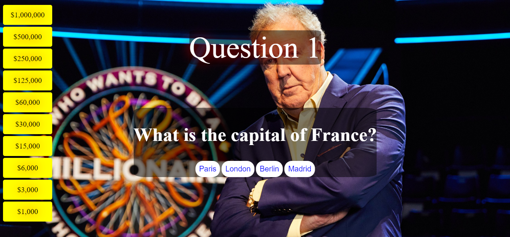

# Who Wants To Be A Millionaire

## Overview

Welcome to the "Who Wants to Be a Millionaire" game! This is a classic trivia game where players answer questions to win money. The game is designed to be both fun and challenging, with a variety of questions to test your knowledge.

## Table of Contents
- [Who-want-to-be-a-millionaire](#Who-want-to-be-a-millionaire)
  - [Overview](#overview)
  - [Table of Contents](#table-of-contents)
  - [Demo](#demo)
  - [Features](#features)
  - [How to Play](#how-to-play)
  - [Project Structure](#project-structure)
    - [Folder \& File Explanation:](#folder--file-explanation)
  - [Installation](#installation)
    - [Steps](#steps)
    - [Prerequisites](#prerequisites)
    - [Technologies Used](#technologies-used)

## Demo

You can play the game online by visiting: [Play here!](https://Mahdicoding1987.github.io/Who-want-to-be-a-millionaire/)



## Features

- **Ten Questions
- **Four Answers for each question only one is correct
- **After each correct answer you go to the next question
- ** If you answer is wrong you start again from the first question


## How to Play

1. **Start the Game**: Click the "Start Game" button to begin the game.
2. **Answer Questions**: Read each question carefully and select the correct answer from the provided options.
3. **Earn Money**: Earn money for each correct answer. The amount of money you earn increases with each correct answer.
4. **Win the Game**: Reach the final question and answer it correctly to win the game and become a millionaire!

  ## Project Structure
The project is organized into the following directories and files:
### Folder & File Explanation:
- **assets/**: Contains images used in the game, including the card images and game logo.
- **css/**: Contains the `style.css` file that handles all styling for the game.
- **js/**: Contains the `app.js` file where the main game logic and interactivity are implemented.
- **index.html**: The main HTML file that builds the game interface and structure.
- **README.md**: The project documentation file providing details on how to set up and play the game.


## Installation
To run this project locally, follow these steps:
### Steps
 1. Clone the repository:
   ```bash
   git clone https://github.com/Mahdicoding1987/Who-want-to-be-a-millionaire.git
2. Navigate into the project directory:
   ```bash
   cd Who-want-to-be-a-millionaire

### Prerequisites
- A web browser (Google Chrome, Firefox, or Safari)

### Technologies Used
* HTML5: Structure of the game.
* CSS3: Styling the game and ensuring responsive design.
* JavaScript (ES6): Game logic and interactivity.

### Strech Goals

* Add a timer for each question.
* Add a leaderboard to track the top players.
* Add a sound effect for correct and incorrect answers.
* Add a feature to save the game progress and resume later.
* Add a feature to share the game results on social media

